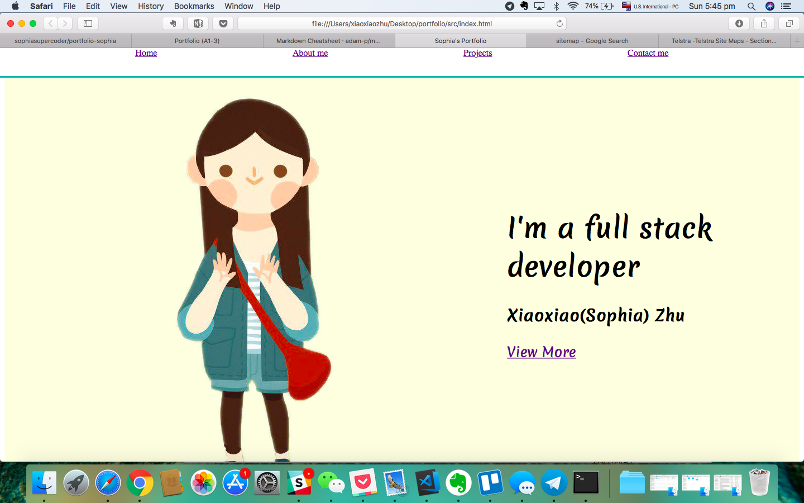

# My Portfolio
## Link to portfolio
file:///Users/xiaoxiaozhu/Desktop/portfolio/src/index.html
## Link to GitHub repo
https://github.com/sophiasupercoder/portfolio-sophia
## Description
1. Purpose
This website is to lure my future employer and demonstrate the skills i have acquaired.
2. Functionality / features
There are four pages for my portfolio website, which are Home, About me, Projects and Contact me. Home page is just a splash page of my portfolio, About me page is a basic introduction of my skills and my background. Projects page is a showcase of my previous projects for different skills. Contact me page is to let people leave their message and email address to get in touch.There is a navigation bar at the top of Home page to click, so it will take users to the target individual pages. Also at the end of the Contact me page, there are links to my social media pages like facebook, twitter, linked in and github.

3. Sitemap
Home     splash page
About me    skill level
Project     portfolio content(previous projects)
Contact me    contact form and links to social media pages

4. Screenshots

5. Tech stack html, css, deployment platform, etc)

### Purpose
This website is to lure my future employer and demonstrate the skills i have acquaired.
### Functionality / features
There are four pages for my portfolio website, which are Home, About me, Projects and Contact me. Home page is just a splash page of my portfolio, About me page is a basic introduction of my skills and my background. Projects page is a showcase of my previous projects for different skills. Contact me page is to let people leave their message and email address to get in touch.There is a navigation bar at the top of Home page to click, so it will take users to the target individual pages. Also at the end of the Contact me page, there are links to my social media pages like facebook, twitter, linked in and github.
### Sitemap
Home     splash page
About me    skill level
Project     portfolio content(previous projects)
Contact me    contact form and links to social media pages

### Screenshots

### Target audience
start-up companies who need tech support

### Tech stack
html, css, github page.
## Design documentation

### Design process
### Wireframes
### Usability considerations

## Details of planning process

### Project plan & timeline

### Screenshots of Trello board(s)

## Short Answer Q&A - Include short answers to the following questions,
1. Describe key events in the development of the internet from the 1980s to today (max. 150 words)
1981: The National Science Foundation (NSF) provided a grant to establish the Computer Science Network (CSNET) to provide networking services to university computer scientists.

1982: Transmission Control Protocol (TCP) and Internet Protocol (IP), as the protocol suite, commonly known as TCP/IP, emerge as the protocol for ARPANET. This results in the fledgling definition of the Internet as connected TCP/IP internets. TCP/IP remains the standard protocol for the Internet.

1991: CERN introduces the World Wide Web to the public.

1992: The first audio and video are distributed over the Internet. The phrase "surfing the Internet" is popularized.

2003: The SQL Slammer worm spread worldwide in just 10 minutes. Myspace, Skype and the Safari Web browser debut.

1998: The Google search engine is born, changing the way users engage with the Internet.

2016: Google unveils Google Assistant, a voice-activated personal assistant program, marking the entry of the Internet giant into the "smart" computerized assistant marketplace. Google joins Amazon's Alexa, Siri from Apple, and Cortana from Microsoft.

2.  Define and describes the relationship between fundamental aspects of the internet such as: domains, web servers, DNS, and web browsers (max. 150 words)
The domain name is the address pointing to the website. Web server is a computer for hostisng your website files.

3.  Reflect on one aspect of the development of internet technologies and how it has contributed to the world today (max. 150 words)

